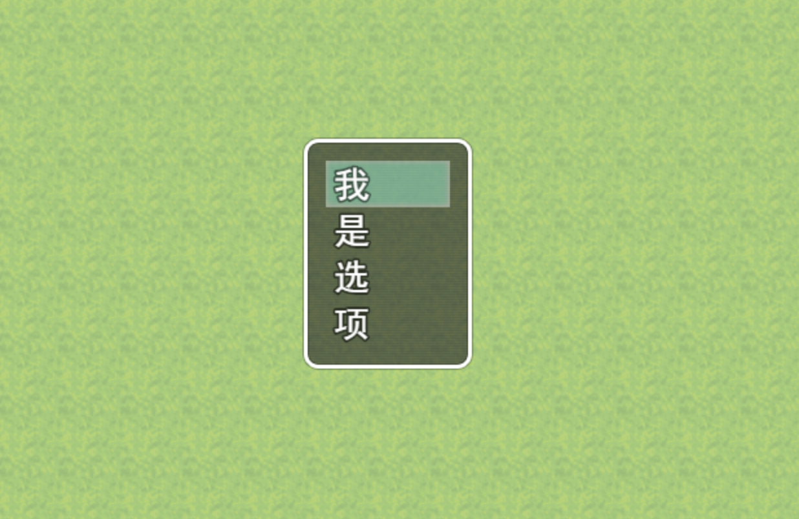
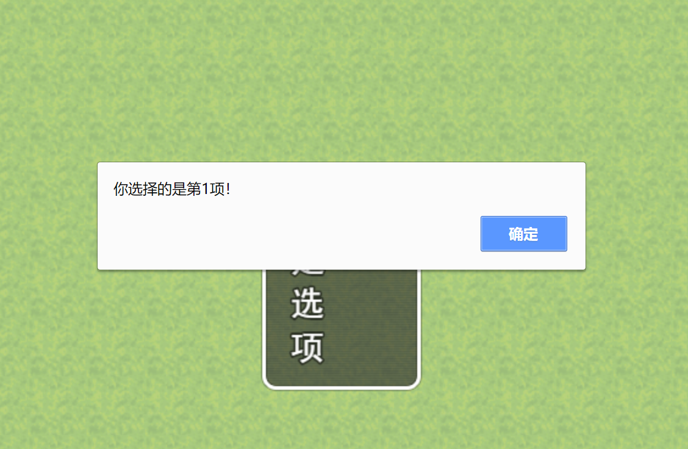

# RPG-MV脚本API速查
---

本篇文档记录了RPG Maker MV已知的脚本API

## 信息

### 显示文字

*Show Text*

共有4处可设定；

#### （可选）脸图

描述：

指定脸图给弹出的文本框，与事件编辑器-显示文字-脸图功能相同

```js:no-line-numbers title="JavaScript"
$gameMessage.setFaceImage(faceName, faceIndex);
```
|参数|<div style="white-space: nowrap;">参数类型</div>|<div style="white-space: nowrap;">默认值</div>|说明|
| :---: | :---: | :---: | --- |
|faceName|`String`|none|脸图的文件名|
|faceIndex|<div style="white-space: nowrap;">`Int`(0-7)</div>|none|脸图从左往右分别是0-3，第二行是4-7|

#### （可选）背景

描述：

文本框背景样式，与下拉菜单选择功能相同

```js:no-line-numbers title="JavaScript"
$gameMessage.setBackground(background);
```
|参数|<div style="white-space: nowrap;">参数类型</div>|<div style="white-space: nowrap;">默认值</div>|说明|
| :---: | :---: | :---: | --- |
|background|<div style="white-space: nowrap;">`Int`(0-2)</div>|0|0：窗口，1：暗淡，2：透明|

#### （可选）窗口位置

描述：

文本框位置，与下拉菜单选择功能相同

```js:no-line-numbers title="JavaScript"
$gameMessage.setPositionType(positionType);
```
|参数|<div style="white-space: nowrap;">参数类型</div>|<div style="white-space: nowrap;">默认值</div>|说明|
| :---: | :---: | :---: | --- |
|positionType|<div style="white-space: nowrap;">`Int`(0-2)</div>|2[(?)](#标识)|0：顶部，1：中间，2：底部|

#### 文本内容

描述：

显示文字方法中的关键组成，这部分用于指定弹出文本框中的文字部分

```js:no-line-numbers title="JavaScript"
$gameMessage.add(text);
```
|参数|<div style="white-space: nowrap;">参数类型</div>|<div style="white-space: nowrap;">默认值</div>|说明|
| :---: | :---: | :---: | --- |
|text|<div style="white-space: nowrap;">`String`</div>|none|对话框中的内容|

#### **用法实例**
---

```js:no-line-numbers title="JavaScript"
$gameMessage.setFaceImage("Actor1",0);
$gameMessage.setBackground(0);
$gameMessage.setPositionType(2);
$gameMessage.add("内容");
```


### 显示选项

*Show Choices*

共有4处可设定；

#### （可选）选择框背景

描述：

与事件编辑器-显示选项下拉菜单的背景功能相同

```js:no-line-numbers title="JavaScript"
$gameMessage.setChoiceBackground(0);
```
|参数|<div style="white-space: nowrap;">参数类型</div>|<div style="white-space: nowrap;">默认值</div>|说明|
| :---: | :---: | :---: | --- |
|background|<div style="white-space: nowrap;">`Int`(0-2)</div>|0|0：窗口，1：暗淡，2：透明|

#### （可选）窗口位置

描述：

与事件编辑器-显示选项下拉菜单的窗口位置功能相同

```js:no-line-numbers title="JavaScript"
$gameMessage.setChoicePositionType(positionType);
```
|参数|<div style="white-space: nowrap;">参数类型</div>|<div style="white-space: nowrap;">默认值</div>|说明|
| :---: | :---: | :---: | --- |
|positionType|<div style="white-space: nowrap;">`Int`(0-2)</div>|2[(?)](#标识)|0：顶部，1：中间，2：底部|

#### 选项本体

描述：

核心功能，选项本体的内容

```js:no-line-numbers title="JavaScript"
$gameMessage.setChoices(choices, defaultType, cancelType);
```
|参数|<div style="white-space: nowrap;">参数类型</div>|<div style="white-space: nowrap;">默认值</div>|说明|
| :---: | :---: | :---: | --- |
|choices|<div style="white-space: nowrap;">`Array`</div>|none|选项的内容，例如\["是", "否"\]|
|defaultType|<div style="white-space: nowrap;">`Int`</div>|0|默认指向的选项，由0开始从上到下|
|cancelType|<div style="white-space: nowrap;">`Int`</div>|0|与显示选项中取消功能相同|

#### 回调函数

描述：

返回用户选择的选项

```js:no-line-numbers title="JavaScript"
$gameMessage.setChoiceCallback(callback);
```
|参数|<div style="white-space: nowrap;">参数类型</div>|<div style="white-space: nowrap;">默认值</div>|说明|
| :---: | :---: | :---: | --- |
|callback|<div style="white-space: nowrap;">`Int`</div>|none|选中的选项，由0开始从上到下|

#### **用法实例**

```js title="JavaScript"
$gameMessage.setChoices(["我", "是", "选", "项"], 0, 2);
$gameMessage.setChoiceBackground(0);
$gameMessage.setChoicePositionType(1);
$gameMessage.setChoiceCallback(function(n){
  alert("你选择的是第"+(n+1)+"项！")
});
```



### 数值输入处理

*Input Number*

描述：

与事件编辑器-数值输入处理功能相同，但脱离了RM-MV只能输入8位数的限制

```js:no-line-numbers title="JavaScript"
$gameMessage.setNumberInput(variableId ,maxDigits);
```
|参数|<div style="white-space: nowrap;">参数类型</div>|<div style="white-space: nowrap;">默认值</div>|说明|
| :---: | :---: | :---: | --- |
|variableId|<div style="white-space: nowrap;">`Int`</div>|none|变量ID|
|maxDigits|<div style="white-space: nowrap;">`Int > 0`</div>|none|输入的位数，此处无限制|

### 物品选择处理

*Select Item*

描述：

与事件编辑器-物品选择处理功能相同：储存所选物品的物品ID；

```js:no-line-numbers title="JavaScript"
$gameMessage.setItemChoice(variableId ,itemType);
```
|参数|<div style="white-space: nowrap;">参数类型</div>|<div style="white-space: nowrap;">默认值</div>|说明|
| :---: | :---: | :---: | --- |
|variableId|<div style="white-space: nowrap;">`Int`</div>|none[(?)](#标识)|变量ID|
|itemType|<div style="white-space: nowrap;">`Int`1-4</div>|1[(?)](#标识)|物品类型，1：普通，2：重要，3：隐藏A，4：隐藏B|

::: warning
如果您不清楚您在做什么，请勿使用此函数
:::

### 显示滚动文字

*Show Scrolling Text*

描述：

与事件编辑器-显示滚动文字功能相同，滚动打印文字

需要与$gameMessage.add();一同使用

```js:no-line-numbers title="JavaScript"
$gameMessage.setScroll(speed, noFast);
```
|参数|<div style="white-space: nowrap;">参数类型</div>|<div style="white-space: nowrap;">默认值</div>|说明|
| :---: | :---: | :---: | --- |
|speed|<div style="white-space: nowrap;">`Float > 0`</div>|2|文字滚动的速度|
|noFast|<div style="white-space: nowrap;">`Boolean`</div>|false|禁止快进文字，true启用，false禁用|

#### **用法实例**

```js title="JavaScript"
$gameMessage.add("内容1");
$gameMessage.add("内容2");
$gameMessage.add("内容3");
$gameMessage.setScroll(2 ,false);
```


## 游戏进程

### 开关操作

### 变量操作

### 独立开关操作

### 计时器操作

## 流程控制

### 分支条件

### 循环

### 跳出循环

### 终止事件处理


#### 空值

描述：

```js:no-line-numbers title="JavaScript"
hello world
```
|参数|<div style="white-space: nowrap;">参数类型</div>|<div style="white-space: nowrap;">默认值</div>|说明|
| :---: | :---: | :---: | --- |
||<div style="white-space: nowrap;">占位</div>|占位|占位|


## 附录

### 标识
---

#### ?

带有此标识代表内容未经验证

#### !

带有此表示的内容为警告内容